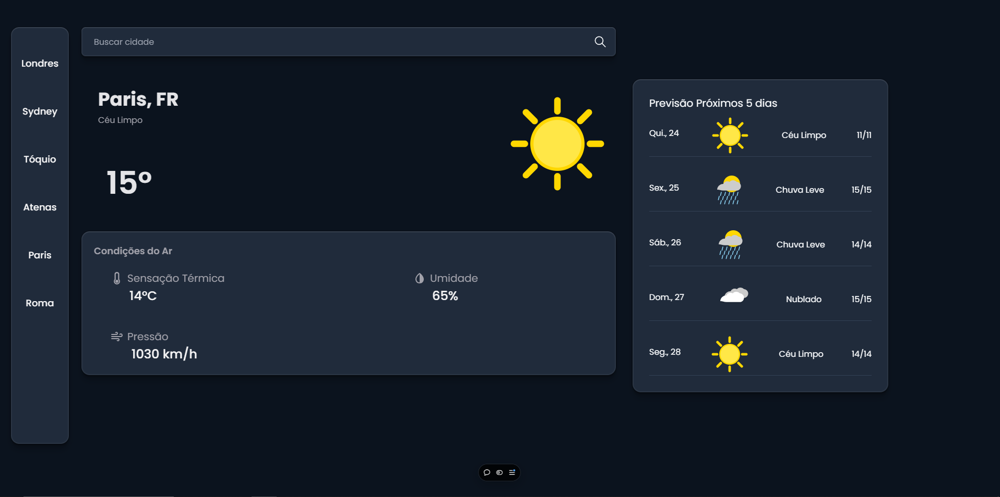

<h1 align="center">Weather App</h1>

<h2>📜 Description of Project</h2>

    This project is a weather forecasting application built with React, JavaScript, and TailwindCSS, utilizing the OpenWeatherMap API for real-time weather data. The application allows users to retrieve current weather conditions and a 5-day forecast for any city, displaying detailed information such as temperature, humidity, and pressure, alongside custom weather icons corresponding to various meteorological conditions.

<strong>Key functionalitie include:</strong>

 - City search functionality: Users can search for weather data by inputting city names or selecting from predefined buttons.
 - Real-time API integration: Data fetched from OpenWeatherMap API using asynchronous requests via axios.
 - Responsive and dynamic UI: Leveraging TailwindCSS to design a fully responsive interface with smooth transitions and detailed weather visuals.
 - State management: useState is used to manage the application's data flow and conditionally render weather details and forecast components.

    This project highlights skills in React component design, API consumption, and building responsive UIs with TailwindCSS.

### 📸 Preview

